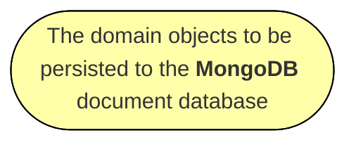
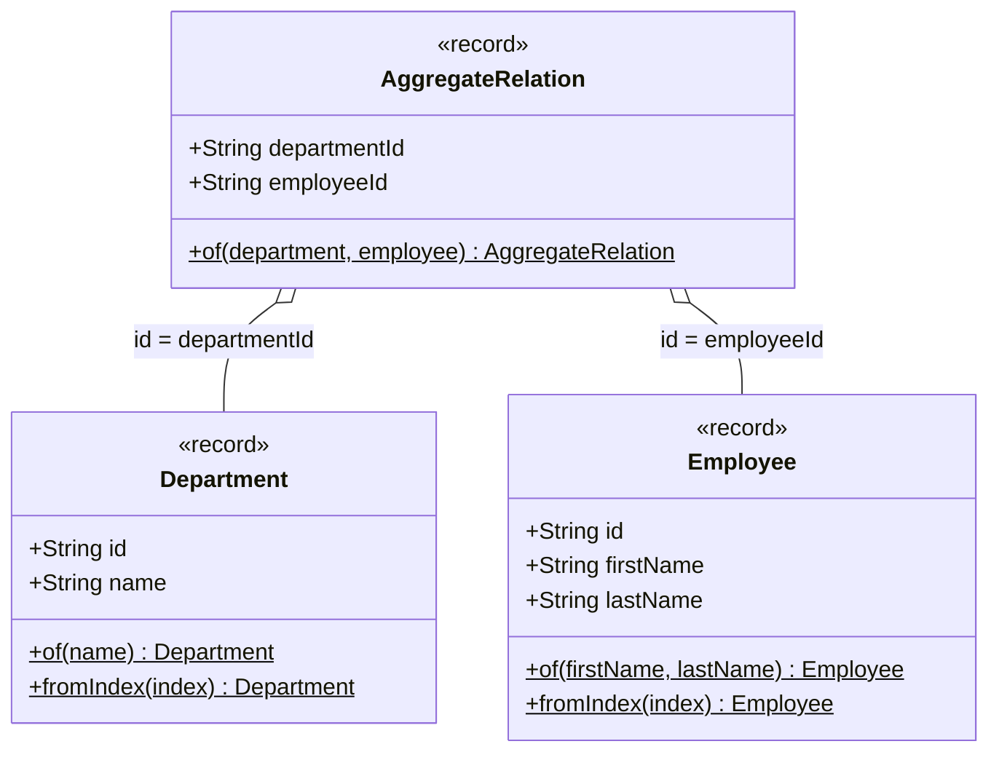
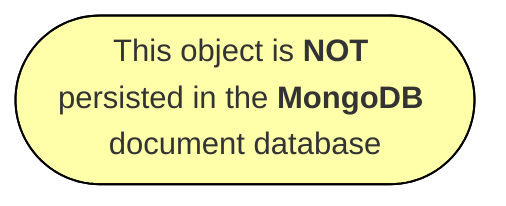
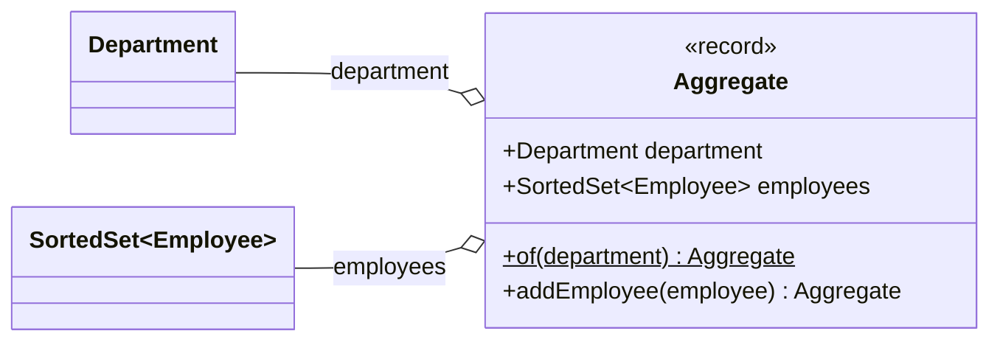

```mermaid
flowchart LR
box([The domain objects to be persisted to the <b>MongoDB</b> document database]):::lightYellowBox
classDef lightYellowBox fill:#ffffaa,stroke:#000
```

```mermaid
classDiagram
class Department {
 <<record>>
 +String id
 +String name
 +of(name)$ Department
 +fromIndex(index)$ Department
}

class Employee {
 <<record>>
 +String id
 +String firstName
 +String lastName
 +of(firstName, lastName)$ Employee
 +fromIndex(index)$ Employee
}
 
class AggregateRelation {
 <<record>>
 +String departmentId
 +String employeeId
 +of(department, employee)$ AggregateRelation
}
 
AggregateRelation o-- Department : id = departmentId
AggregateRelation o-- Employee : id = employeeId
```

```mermaid
flowchart LR
box([This object is <b>NOT</b> persisted in the <b>MongoDB</b> document database]):::lightYellowBox
classDef lightYellowBox fill:#ffffaa,stroke:#000
```

```mermaid
classDiagram
direction RL
class SortedSet~Employee~
 
class Aggregate {
 <<record>>
 +Department department
 +SortedSet~Employee~ employees
 +of(department)$ Aggregate
 +addEmployee(employee) Aggregate
}

Aggregate o-- Department : department
Aggregate o-- SortedSet : employees
```