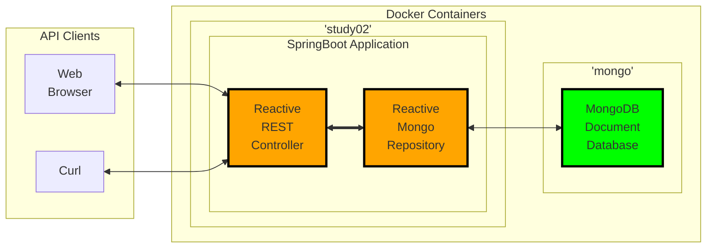

```mermaid
flowchart LR
 subgraph Docker Containers
  subgraph 'study02'
   subgraph SpringBoot Application
    CON[Reactive\nREST\nController]
    REP[Reactive\nMongo\nRepository]
   end
  end
  subgraph 'mongo'
   DBM[MongoDB\nDocument\nDatabase]
  end
 end
 subgraph API Clients
  WBR[Web\nBrowser]
  CURL[Curl]
 end

 WBR <--> CON:::orangeBox
 CURL <--> CON
 CON <==> REP:::orangeBox
 REP <--> DBM:::greenBox
 
 classDef greenBox   fill:#00ff00,stroke:#000,stroke-width:3px
 classDef orangeBox  fill:#ffa500,stroke:#000,stroke-width:3px
```